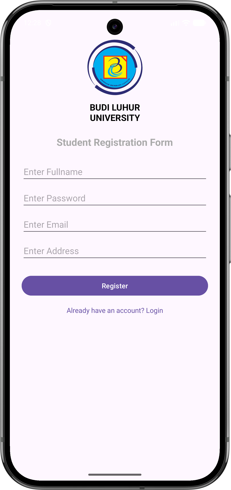
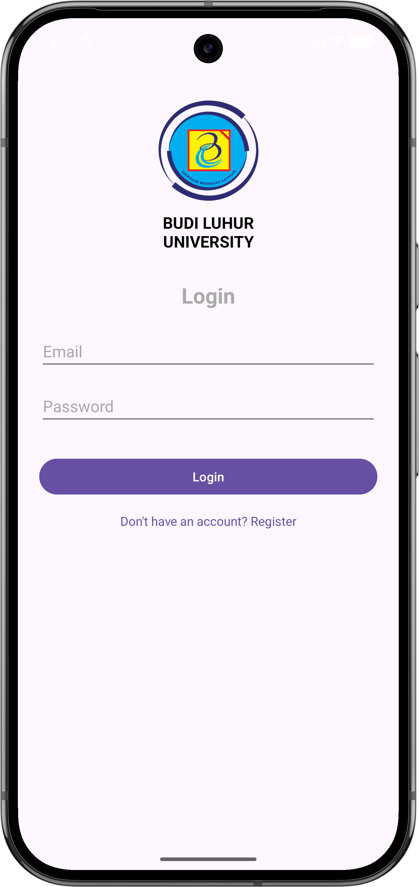
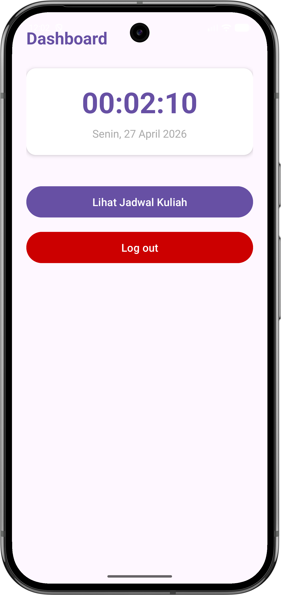
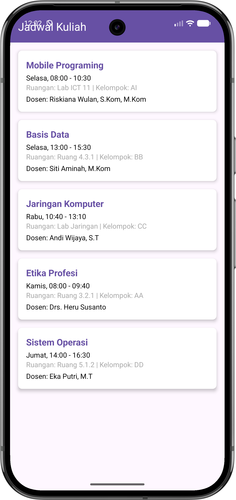

# MyStudentApp 🎓

**MyStudentApp** adalah aplikasi mobile Android profesional yang dirancang untuk membantu mahasiswa mengelola profil akademik dan jadwal perkuliahan secara efisien.

---

## 📱 Alur Aplikasi & Pengalaman Pengguna

### 1. Welcome & Registration

* **Tujuan:** Pintu masuk bagi pengguna baru.
* **Fitur Utama:** Form pendaftaran dengan dukungan **Autofill** dan validasi real-time.

### 2. Secure Login

* **Tujuan:** Autentikasi untuk melindungi data mahasiswa.
* **Fitur Utama:** Validasi kredensial lokal dengan sistem keamanan sesi yang mencegah akses tidak sah.

### 3. Student Dashboard

* **Tujuan:** Pusat informasi utama (Hub).
* **Fitur Utama:** Real-time clock, tanggal dinamis bahasa Indonesia, dan navigasi cepat.

### 4. Lecture Schedule

* **Tujuan:** Menampilkan komitmen akademik mingguan.
* **Fitur Utama:** Menggunakan **RecyclerView** dengan desain kartu yang bersih dan responsif.

---

## 🛠 Detail Implementasi Teknis

### Arsitektur & Standar Modern
* **Java 8+:** Fitur *Lambdas* untuk event handling yang bersih.
* **Build System:** **AGP 9.2.0** dan **Gradle 9.4.1**.
* **UI Framework:** Material Design 3 (M3).

### Library Utama
* **Material Components:** Komponen UI standar industri.
* **ConstraintLayout:** Tata letak responsif.
* **CardView:** Hierarki visual yang elegan.

---

## 🚀 Instalasi & Persiapan

1. **Clone Repository**
   ```bash
   git clone [https://github.com/username/MyStudentApp.git](https://github.com/username/MyStudentApp.git)
